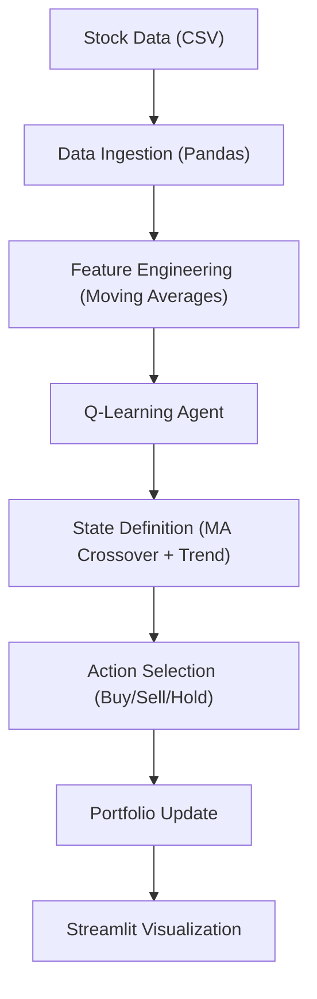

# Technical Specification: Optimizing Stock Trading Strategy

## Architectural Overview

**Optimizing Stock Trading Strategy With Reinforcement Learning** is a predictive modeling study designed to demonstrate the application of Q-Learning in optimizing trading decisions. The project serves as a digital exploration into machine learning heuristics for financial markets, established during a Data Science internship program at Technocolabs Software.

### Analytics Pipeline

---

## Technical Implementations

### 1. Modeling Architecture
-   **Core**: Built on **NumPy** and **Pandas**, utilizing custom Q-Learning logic for decision making.
-   **Estimation Logic**: Establishing a relationship between market states (Moving Averages) and optimal actions to maximize portfolio value.

### 2. Evaluation & Validation
-   **Metrics**: Evaluates performance based on net worth accumulation over a 5-year period compared to a buy-and-hold strategy.
-   **Reproducibility**: Utilizes historical stock data to promote consistent testing environments.
-   **Heuristics**: Scalable decision logic encapsulated in a python script to process real-time simulation.

### 3. Developmental Infrastructure
-   **Notebook Runtime**: The primary research was conducted in **Jupyter Notebook**, exploring state representation and reward functions.
-   **Source Production**: The analytical kernel is deployed via a **Streamlit App**, bridging the gap between statistical modeling and end-user interactive application.

---

## Technical Prerequisites

-   **Runtime**: Python 3.7+ environment (Local or Cloud-based).
-   **Dependencies**: `pandas`, `numpy`, `streamlit`, and `plotly` libraries.

---

*Technical Specification | Data Science | Version 1.0*
